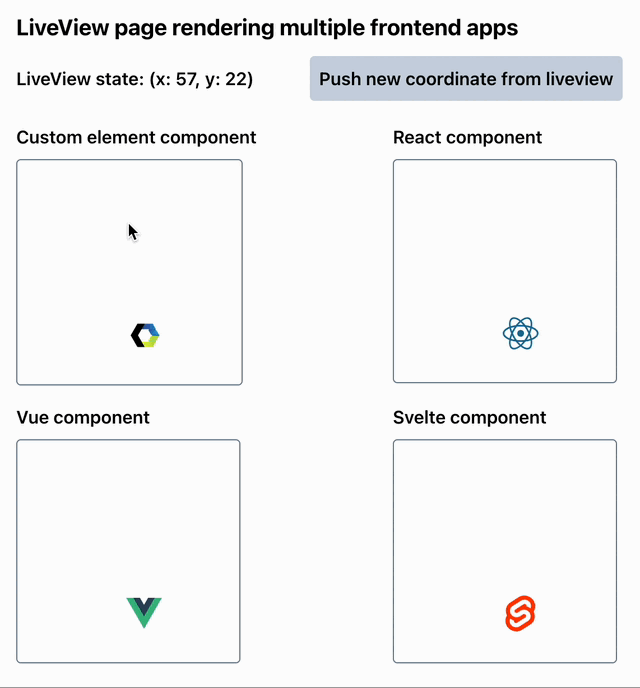

# Komodo

Use components from Javascript frameworks in your [Phoenix Liveview](https://hexdocs.pm/phoenix_live_view/Phoenix.LiveView.html) with ease!



NOTE: this library does **not** cover bundling/transpiling of components for each Javascript framework - it's concerned more with providing a standard interface for using the components in LiveView. However each README for supported frameworks will give pointers where necessary which should be enough to get it working.

## Background

Many Javascript frameworks allow for reusing components by employing a **props-in** (i.e. data), **callbacks-out** (or "events-out") model. Komodo allows for using these components in your Phoenix LiveView in the same way.

For example, if you were to use a React component like so:

```jsx
<MyReactComponent
  user={user}
  onChangeUser={(newUser) => handleUpdateUser(newUser)}
/>
```

then you could use this component from your LiveView like so:

```heex
def render(assigns) do
  ~H"""
  <.js_component
    id="my-react-component"
    name="MyReactComponent"
    props={%{
      user: @user
    }}
    callbacks={%{
      onChangeUser: {"update_user", "&1"}
    }}
  />
  """
end

def handle_event("update_user", new_user, socket) do
  // ...
end
```

For this to work, a Javascript component with the name `"MyReactComponent"` needs to be registered (see [Setup](#setup) below), using an adapter for the specific framework (in this case React).

Adapters are small pieces of Javascript code that wrap a framework component into a standardized JS component that is compatible with the code above.

See [Supported Adapters](#supported-adapters) below for supported frameworks and how to create adapters for other frameworks.

To understand how parameters are sent from callbacks to `handle_event`, see [Callback Parameters](#callback-parameters) below.

## Installation

This package is [on Hex](https://hexdocs.pm/komodo), so you can add`komodo` to your list of dependencies in `mix.exs`:

```elixir
def deps do
  [
    {:komodo, "~> 0.0.1"}
  ]
end
```

and run `mix deps.get`.

Add the javascript library to your assets `package.json`:

```js
"dependencies": {
  // ...
  "komodo": "file:../deps/komodo"
}
```

and install - `npm install --prefix assets`.

## Setup

Given a Phoenix app `MyApp`:

1. Import the provided components for use in heex templates

In `my_app_web.ex`:

```diff
defmodule MyAppWeb do

  # ...

  def html_helpers do
    # ...
+    import Komodo.Components
    # ...
  end

  # ...
end
```

2. Add the provided hook to the LiveSocket

In `app.js`:

```diff
// ...
+ import { registerJsComponents } from "komodo";

// ...

let liveSocket = new LiveSocket("/live", Socket, {
  // ...
  hooks: {
+    komodo: registerJsComponents({
+      // individual JS components will go here
+    })
  }
});

// ...
```

## Callback parameters

A string specification is used to tell `js_component` how to transform callback payloads into a `parameters` argument to send back to the liveview.
It makes use of the `&` to specify the argument number (which should already be familiar to Elixir users), as well as `.` and `[]` to access nested data.

For example, `"&1"` means the first argument, and `"&1.users[2]"` means the 3rd item in the users property of the first argument.

This should be intuitive as it follows Elixir/Javascript convention, however note that the argument number `&1` starts from 1 whereas the array access index `[2]` starts from 0, as should be familiar.

This will be better understood with an example...

supposing the javascript component has a callback `onChangeTrack` that emits two arguments:

- the new song `{title: ""El Pocito"}`
- the artist `{name: "Vicente Amigo"}`

i.e. in javascript you would do something like

```jsx
onChangeTrack={(newSong, newArtist) => handleChangeTrack(...)}
```

Then the liveview will be called with

```ex
def render(assigns) do
  ~H"""
  <.js_component
    ...
    callbacks={%{
      onChangeTrack: ???
    }}
  />
  """
end

def handle_event("change_track", parameters, socket) do
  // ...
end
```

The table below shows what to put in place of `???` to form the `parameters` argument given to `handle_event`.

| Callback spec (`???`)                                      | `parameters`                                   | Notes                                       |
| ---------------------------------------------------------- | ---------------------------------------------- | ------------------------------------------- |
| `"change_track"`                                           | `%{}`                                          | Defaults to an empty map                    |
| `{"change_track", "&1"}`                                   | `%{"title" => "El Pocito"}`                    | The first argument                          |
| `{"change_track", "&1.title"}`                             | `"El Pocito"`                                  | Something nested inside the first argument  |
| `{"change_track", ["&1.title", "&2.name"]}`                | `["El Pocito", "Vicent Amigo"]`                | A list combining elements of both arguments |
| `{"change_track", %{song: "&1.title", artist: "&2.name"}}` | `%{song: "El Pocito", artist: "Vicent Amigo"}` | A map combining elements of both arguments  |

Many frameworks will only have one argument so you will often be using `"&1.xxx"` etc.

## Supported adapters

See documentation for the particular adapter you're using, e.g. one of

- [Svelte](https://github.com/hungry-egg/komodo/tree/main/packages/svelte)
- [React](https://github.com/hungry-egg/komodo/tree/main/packages/react)
- [Vue](https://github.com/hungry-egg/komodo/tree/main/packages/vue)

## Custom Adapters

Adapters for each framework are small and easy to write for new libraries.
TODO: doc here.
